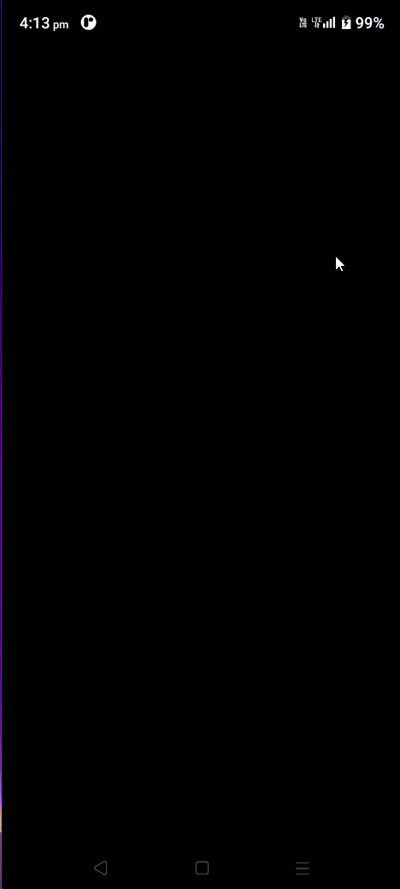

# **Project Title: to_do_app**

## **Description :**

The To-Do App is a lightweight, responsive task management application built using Flutter. It enables users to efficiently manage their daily tasks with intuitive controls and a clean UI. The app supports full CRUD operations (Create, Read, Update, Delete) for tasks and uses Provider for state management to ensure scalable and reactive architecture.

## **Core Features :**
 * Add Tasks: Users can create new tasks by entering a title and description.
 * Update Status: Tasks can be marked as complete or incomplete using a toggle switch.
 * Delete Tasks: Users can remove tasks from the list permanently.
 * Task Display: All tasks are shown in a scrollable ListView, with completed tasks styled using a strikethrough effect

## **UI Design :**
 * Responsive Layout: Adapts to various screen sizes and orientations.
 * Strikethrough Styling: Completed tasks are visually distinguished with a line-through text style.
 * Card-Based Presentation: Each task is displayed inside a styled card for better readability.
 * Dark/Light Theme Support (optional): Can be extended using AdaptiveTheme or similar packages.

<<<<<<< HEAD
## **Architecture & State Management :**
=======
## **Architecture & State Management:**
>>>>>>> 3b8f040aa5f4a1a338b4fe3f27f88d8b65b88781
 * Flutter Framework: For cross-platform mobile development.
 * Provider Package: Used for efficient and scalable state management.
 * Modular Codebase: Separation of concerns between UI, logic, and data models.
